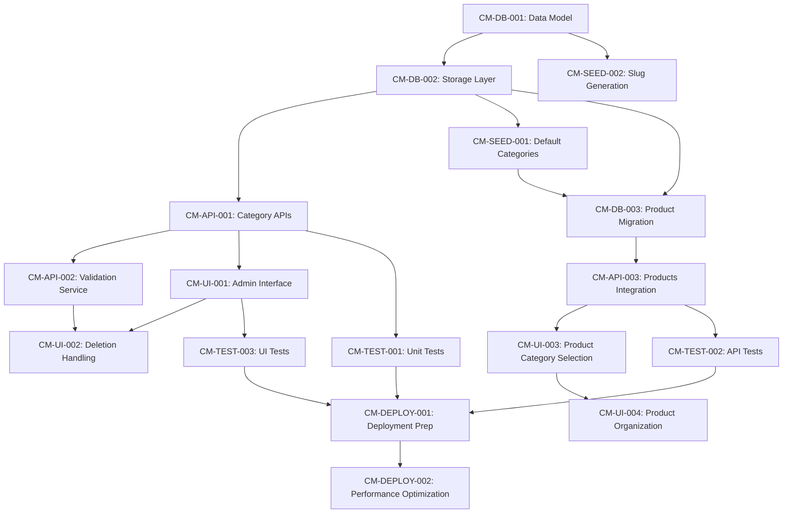

# Category Management Implementation Tasks

## Database & Data Model Tasks

### Task CM-DB-001: Create Category Data Model
- Define Category interface with id, name, description, parentId, slug fields
- Add validation constraints for 2-level hierarchy
- Create CategoryTree interface for hierarchical data representation
- Update ProductIndexItem interface to include categoryId and categoryPath
- **Dependencies**: None
- **Estimated Effort**: 2 hours
- **Acceptance Criteria**: Type definitions compile and pass validation

### Task CM-DB-002: Implement Category Storage Layer
- Create category storage functions in blob storage system
- Implement CRUD operations for categories with JSON persistence
- Add category hierarchy validation in storage layer
- Create category lookup and tree-building utilities
- **Dependencies**: CM-DB-001
- **Estimated Effort**: 4 hours
- **Acceptance Criteria**: Category operations persist correctly with hierarchy validation

### Task CM-DB-003: Migrate Existing Product Categories
- Create migration script to convert string categories to structured references
- Map existing category strings to new category IDs
- Update all product records with categoryId and categoryPath
- Preserve backward compatibility with legacy category field
- **Dependencies**: CM-DB-002, Default Categories (CM-SEED-001)
- **Estimated Effort**: 3 hours
- **Acceptance Criteria**: All products have valid category references, no data loss

## API Development Tasks

### Task CM-API-001: Categories API Endpoints
- Implement GET /api/categories for hierarchical category listing
- Create POST /api/categories for category creation with validation
- Add PUT /api/categories/:id for category updates
- Implement DELETE /api/categories/:id with dependency handling
- **Dependencies**: CM-DB-002
- **Estimated Effort**: 6 hours
- **Acceptance Criteria**: All CRUD operations work with proper validation and error handling

### Task CM-API-002: Category Validation Service
- Create category name uniqueness validation within parent scope
- Implement hierarchy depth validation (max 2 levels)
- Add category relationship validation (prevent circular references)
- Create category impact analysis for deletion operations
- **Dependencies**: CM-DB-002
- **Estimated Effort**: 3 hours
- **Acceptance Criteria**: All business rules enforced, proper error messages returned

### Task CM-API-003: Enhanced Products API Integration
- Update products API to support category filtering by categoryId
- Add category path resolution in product responses
- Implement category-based product search enhancements
- Update product creation/editing to use structured categories
- **Dependencies**: CM-API-001, CM-DB-003
- **Estimated Effort**: 4 hours
- **Acceptance Criteria**: Products API fully integrated with category system

## Frontend UI Tasks

### Task CM-UI-001: Category Management Admin Interface
- Create CategoryManagement component for admin category CRUD
- Implement hierarchical category tree display with expand/collapse
- Add category creation modal with parent selection
- Create category editing interface with validation feedback
- **Dependencies**: CM-API-001
- **Estimated Effort**: 8 hours
- **Acceptance Criteria**: Complete admin interface for category management

### Task CM-UI-002: Category Deletion Handling Interface
- Create confirmation dialogs for category deletion
- Implement product reassignment options interface
- Add subcategory handling options (promote/move/cascade)
- Display impact analysis (affected products/subcategories count)
- **Dependencies**: CM-API-002, CM-UI-001
- **Estimated Effort**: 4 hours
- **Acceptance Criteria**: Safe category deletion with user control over impacts

### Task CM-UI-003: Enhanced Product Category Selection
- Update ProductBuilderForm with hierarchical category selector
- Create CategorySelector component with parent-child navigation
- Add category path display in product forms
- Implement category filtering in product search interface
- **Dependencies**: CM-API-003
- **Estimated Effort**: 5 hours
- **Acceptance Criteria**: Intuitive category selection throughout product workflow

### Task CM-UI-004: Category-Based Product Organization
- Enhance ProductsList with category filtering sidebar
- Add category breadcrumb navigation
- Implement category-based product grouping/sorting
- Create category filter chips with product counts
- **Dependencies**: CM-UI-003
- **Estimated Effort**: 6 hours
- **Acceptance Criteria**: Products organized and filterable by categories

## Data Seeding Tasks

### Task CM-SEED-001: Create Default Category Structure
- Implement category seeding function with default e-commerce categories
- Define 5 parent categories: Electronics, Clothing, Home & Garden, Health & Beauty, Sports
- Create 3-5 relevant subcategories under each parent
- Add category descriptions and metadata
- **Dependencies**: CM-DB-002
- **Estimated Effort**: 2 hours
- **Acceptance Criteria**: Default categories available on fresh installation

### Task CM-SEED-002: Category Slug Generation
- Implement slug generation utility for category URLs
- Create unique slug validation and collision handling
- Add slug-based category lookup functionality
- Update category creation to auto-generate slugs
- **Dependencies**: CM-DB-001
- **Estimated Effort**: 2 hours
- **Acceptance Criteria**: All categories have valid, unique slugs

## Testing Tasks

### Task CM-TEST-001: Category Management Unit Tests
- Write unit tests for category CRUD operations
- Test hierarchy validation and constraint enforcement
- Create tests for category relationship management
- Add tests for category impact analysis functions
- **Dependencies**: CM-DB-002, CM-API-002
- **Estimated Effort**: 4 hours
- **Acceptance Criteria**: 90%+ test coverage for category management core logic

### Task CM-TEST-002: Category API Integration Tests
- Create integration tests for all category API endpoints
- Test category creation, reading, updating, deletion workflows
- Add tests for error handling and validation responses
- Test category-product relationship integrity
- **Dependencies**: CM-API-001, CM-API-003
- **Estimated Effort**: 3 hours
- **Acceptance Criteria**: All API endpoints tested with success and error scenarios

### Task CM-TEST-003: Category UI Component Tests
- Write React Testing Library tests for category management components
- Test category tree display and interaction
- Add tests for category selection and validation
- Test category deletion confirmation workflows
- **Dependencies**: CM-UI-001, CM-UI-002
- **Estimated Effort**: 4 hours
- **Acceptance Criteria**: All category UI components have comprehensive test coverage

## Deployment Tasks

### Task CM-DEPLOY-001: Category Management Deployment Preparation
- Create deployment checklist for category management feature
- Prepare database migration scripts for production
- Add environment-specific configuration for category defaults
- Create rollback procedures for category system changes
- **Dependencies**: All implementation tasks
- **Estimated Effort**: 2 hours
- **Acceptance Criteria**: Safe deployment process with rollback capability

### Task CM-DEPLOY-002: Performance Optimization
- Implement category caching strategy for hierarchy data
- Optimize category tree building algorithms
- Add database indexing for category queries
- Monitor and optimize category-based product filtering performance
- **Dependencies**: CM-DEPLOY-001
- **Estimated Effort**: 3 hours
- **Acceptance Criteria**: Category operations meet performance requirements (500ms loading, 200ms CRUD)

## Task Dependencies Overview

## Estimated Total Effort: 65 hours

### Phase 1 (Foundation): 13 hours
- Data model, storage layer, validation, seeding

### Phase 2 (Core Features): 22 hours  
- API development, admin interface, basic testing

### Phase 3 (Integration): 15 hours
- Product integration, enhanced UI, migration

### Phase 4 (Polish): 15 hours
- Comprehensive testing, deployment, optimization