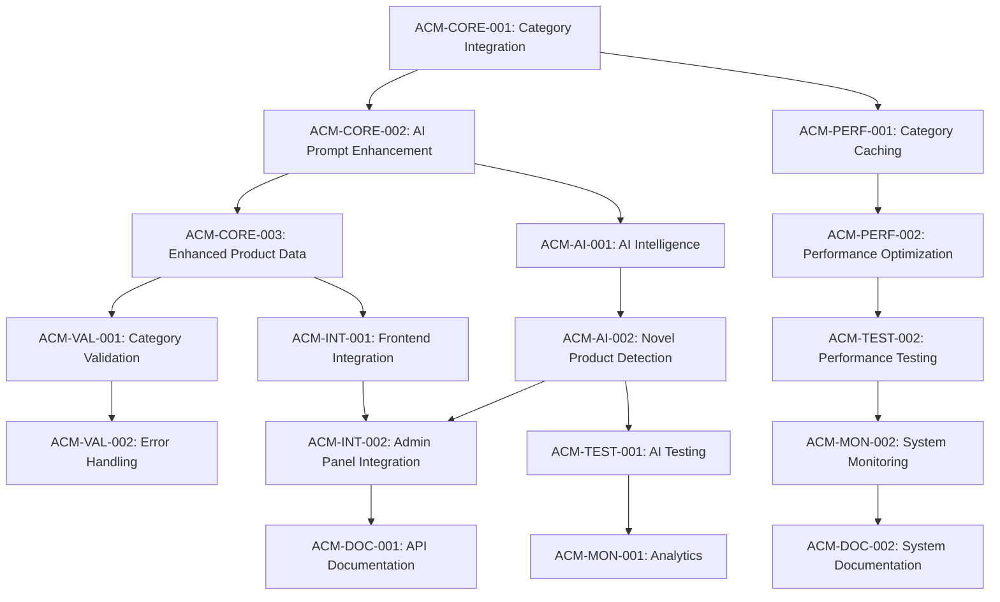

# AI Category Mapping Implementation Tasks

## Core Integration Tasks

### Task ACM-CORE-001: Category Data Integration in Product Generation API
- Modify `/api/generate-product` endpoint to fetch categories before AI generation
- Implement category caching mechanism with TTL and invalidation
- Add category context to AI generation workflow
- Ensure backward compatibility with existing API responses
- **Dependencies**: None (uses existing category API)
- **Estimated Effort**: 3 hours
- **Acceptance Criteria**: Product generation API fetches and caches category data successfully

### Task ACM-CORE-002: AI Prompt Enhancement for Category Selection
- Update AI prompt template to include available categories in structured format
- Add category selection guidelines and requirements to prompt
- Modify AI response parsing to extract category assignment
- Add validation for AI category selections
- **Dependencies**: ACM-CORE-001
- **Estimated Effort**: 4 hours
- **Acceptance Criteria**: AI consistently returns valid category assignments with confidence scores

### Task ACM-CORE-003: Enhanced Product Data Structure
- Update ProductData interface to include categoryId and categoryPath
- Modify product generation response to include category metadata
- Ensure legacy category field is populated for backward compatibility
- Add category assignment validation before product saving
- **Dependencies**: ACM-CORE-002
- **Estimated Effort**: 2 hours
- **Acceptance Criteria**: Generated products include complete category information

## Caching and Performance Tasks

### Task ACM-PERF-001: Category Caching Implementation
- Implement in-memory category cache with configurable TTL (5-10 minutes)
- Add cache invalidation triggers for category modifications
- Create cache warming strategy for improved initial performance
- Add cache metrics and monitoring
- **Dependencies**: ACM-CORE-001
- **Estimated Effort**: 3 hours
- **Acceptance Criteria**: Category cache reduces API calls by 80%+ with fresh data guarantee

### Task ACM-PERF-002: Performance Optimization
- Optimize category data fetching with selective field loading
- Implement parallel processing for category fetch and AI generation preparation
- Add request timeout handling for category service calls
- Monitor and optimize overall generation time impact
- **Dependencies**: ACM-PERF-001
- **Estimated Effort**: 2 hours
- **Acceptance Criteria**: Category integration adds <300ms to generation time

## Validation and Error Handling Tasks

### Task ACM-VAL-001: Category Assignment Validation
- Implement validation logic for AI-selected categoryId existence
- Add categoryPath verification against current hierarchy
- Create fallback logic for invalid category assignments
- Add validation error reporting and logging
- **Dependencies**: ACM-CORE-003
- **Estimated Effort**: 3 hours
- **Acceptance Criteria**: All generated products have valid, verified category assignments

### Task ACM-VAL-002: Fallback and Error Handling
- Implement graceful degradation when category service is unavailable
- Add fallback to cached or default categories during service outages
- Create error handling for malformed category data
- Add comprehensive logging for debugging and monitoring
- **Dependencies**: ACM-VAL-001
- **Estimated Effort**: 3 hours
- **Acceptance Criteria**: System handles category service issues without breaking product generation

## AI Enhancement Tasks

### Task ACM-AI-001: Category Mapping Intelligence
- Enhance AI prompt with category selection best practices
- Add examples of good category assignments for training
- Implement confidence scoring for category selections
- Add alternative category suggestions for ambiguous cases
- **Dependencies**: ACM-CORE-002
- **Estimated Effort**: 4 hours
- **Acceptance Criteria**: AI achieves 90%+ accuracy in category assignments

### Task ACM-AI-002: Novel Product Type Detection
- Add logic to detect when products don't fit existing categories well
- Flag novel product types for potential category expansion
- Implement fallback to parent categories for edge cases
- Add reasoning capture for category assignment decisions
- **Dependencies**: ACM-AI-001
- **Estimated Effort**: 3 hours
- **Acceptance Criteria**: System gracefully handles new product types and provides actionable insights

## Integration and Testing Tasks

### Task ACM-INT-001: Frontend Integration
- Update ProductBuilderForm to display assigned category information
- Show category assignment confidence and reasoning in UI
- Add category override capability for manual corrections
- Integrate with existing category selector components
- **Dependencies**: ACM-CORE-003
- **Estimated Effort**: 4 hours
- **Acceptance Criteria**: Users can see and manage AI-assigned categories

### Task ACM-INT-002: Admin Panel Integration
- Add category assignment monitoring to admin dashboard
- Show novel product type detection results
- Provide category assignment accuracy metrics
- Add manual category override and feedback capabilities
- **Dependencies**: ACM-AI-002, ACM-INT-001
- **Estimated Effort**: 3 hours
- **Acceptance Criteria**: Admins can monitor and improve category assignment performance

## Testing and Quality Tasks

### Task ACM-TEST-001: AI Category Assignment Testing
- Create test cases for various product types and category scenarios
- Test category assignment accuracy across different product categories
- Validate fallback behavior for edge cases and service outages
- Add integration tests for the complete generation workflow
- **Dependencies**: ACM-AI-002
- **Estimated Effort**: 4 hours
- **Acceptance Criteria**: Comprehensive test coverage with 95%+ pass rate

### Task ACM-TEST-002: Performance and Load Testing
- Test category caching performance under load
- Validate generation time impact with category integration
- Test concurrent request handling and cache consistency
- Monitor memory usage and cache efficiency
- **Dependencies**: ACM-PERF-002
- **Estimated Effort**: 3 hours
- **Acceptance Criteria**: System maintains performance targets under production load

## Monitoring and Analytics Tasks

### Task ACM-MON-001: Category Assignment Analytics
- Implement logging for category assignment decisions and confidence scores
- Add metrics for category selection patterns and accuracy
- Create dashboards for monitoring AI category performance
- Set up alerts for category assignment failures or low confidence scores
- **Dependencies**: ACM-TEST-001
- **Estimated Effort**: 3 hours
- **Acceptance Criteria**: Comprehensive monitoring and alerting for category assignment quality

### Task ACM-MON-002: System Health Monitoring
- Monitor category service availability and response times
- Track cache hit rates and invalidation patterns
- Add performance metrics for generation time impact
- Create alerts for system degradation or errors
- **Dependencies**: ACM-TEST-002
- **Estimated Effort**: 2 hours
- **Acceptance Criteria**: Proactive monitoring prevents user-facing issues

## Documentation Tasks

### Task ACM-DOC-001: API Documentation Updates
- Update API documentation to include new category fields
- Document category assignment behavior and confidence scoring
- Add examples of enhanced product generation responses
- Create migration guide for clients using legacy category field
- **Dependencies**: ACM-INT-002
- **Estimated Effort**: 2 hours
- **Acceptance Criteria**: Complete and accurate documentation for API consumers

### Task ACM-DOC-002: System Documentation
- Document AI category mapping architecture and design decisions
- Create troubleshooting guide for category assignment issues
- Add runbook for category cache management and monitoring
- Document fallback procedures and error handling protocols
- **Dependencies**: ACM-MON-002
- **Estimated Effort**: 2 hours
- **Acceptance Criteria**: Comprehensive system documentation for maintenance and support

## Task Dependencies Overview

## Estimated Total Effort: 50 hours

### Phase 1 (Core Implementation): 15 hours
- Category integration, AI enhancement, data structure updates

### Phase 2 (Performance & Validation): 14 hours  
- Caching, validation, error handling, performance optimization

### Phase 3 (Intelligence & Integration): 14 hours
- AI improvements, UI integration, admin dashboard

### Phase 4 (Quality & Documentation): 7 hours
- Testing, monitoring, documentation

## Success Metrics

- **Category Assignment Accuracy**: 90%+ of AI selections are appropriate
- **Performance Impact**: <300ms additional latency for generation
- **Cache Efficiency**: 80%+ cache hit rate for category data
- **System Reliability**: 99.9% uptime for category assignment functionality
- **User Satisfaction**: Reduced manual categorization by 95%+